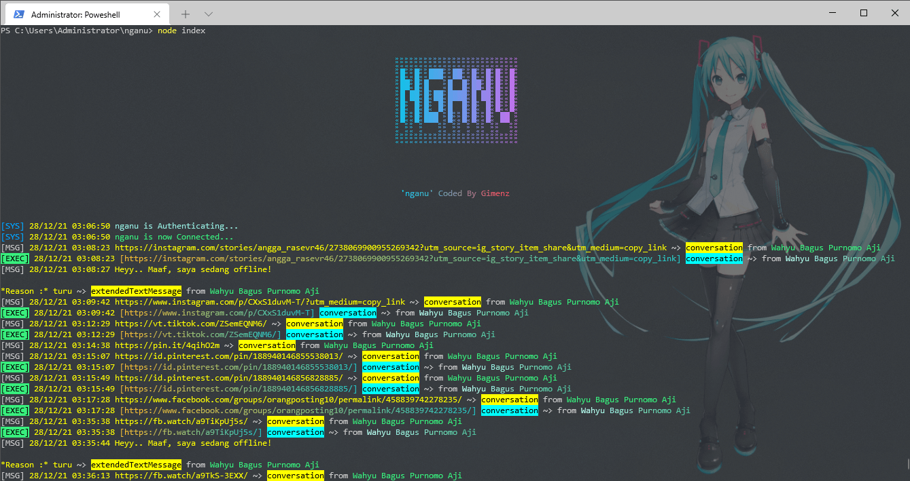

# nganu 

***A Simple Multi-Device WhatsApp Bot***

simple whatsapp-bot using [baileys-md](https://github.com/adiwajshing/Baileys/tree/multi-device/) to download social media post and many features

[](https://heroku.com/deploy?template=https://github.com/Gimenz/nganu) 

[**Join WA Group**](https://chat.whatsapp.com/D5Hua4mepuO35z1ocjnN5X)



## Install
> set instagram session id on [this line](https://github.com/Gimenz/nganu/blob/0a405f1f76910e7864fdc04f6bb17346b2fa0ebb/.env#L2) before run this bot, how to get session id? see [here](https://github.com/Gimenz/insta-fetcher/issues/3#issue-1074562576)

**[ Install on RDP/Windows ]** : For more info, watch this [YouTube](https://youtu.be/VJMz_Hcakk8)

```bash
git clone https://github.com/Gimenz/nganu.git
npm install
npm start
```
**[ Install on Heroku ] :**
 - install ffmpeg [Click here](https://elements.heroku.com/buildpacks/jonathanong/heroku-buildpack-ffmpeg-latest)
 - if all are done. you can scan qr code from web browser, just open yout herokuapp and add /qr in the path, example: https://koncoasu.herokuapp.com/qr

**[ Install on Termux ] :**
 - I never install it on termux, bcz i did'nt have device that can install termux. but you can try it self
  
## Dependencies
- [adiwajshing/baileys-md](https://github.com/adiwajshing/Baileys/tree/multi-device/) - WhatsApp Web Api
- [insta-fetcher](https://github.com/Gimenz/insta-fetcher) - instagram simplified metadata

## License
Copyright (c) 2021 Gimenz . Licensed under the [GNU GPLv3](https://github.com/Gimenz/nganu/blob/master/LICENSE)
